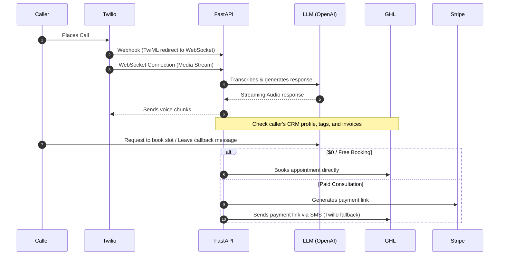

# Reba AI Receptionist

Reba AI is an advanced, real-time voice receptionist and booking assistant designed specifically for CPA, tax firms, and service offices. Powered by FastAPI, Twilio Webhooks (Media Streams), WebSockets, and OpenAI/LLM models, Reba provides a natural, bilingual (English + Banglish) call-handling experience. It directly integrates with **GoHighLevel (GHL)** for CRM/Calendar management and **Stripe** for handling paid consultations.

---

## 🛠️ Tech Stack & Architecture

- **Backend Framework:** FastAPI (Python 3.11/3.13)
- **Database:** PostgreSQL (production-ready) / SQLite (local fallback)
- **Voice Integration:** Twilio (Media Streams, TwiML, WebSockets)
- **CRM Integration:** GoHighLevel API V1 & V2 (OAuth 2.0 with token auto-refresh loop)
- **Payment Processing:** Stripe API (Payment Links generation)
- **Deployment:** Docker Compose + Nginx Reverse Proxy

### 🔄 System Dataflow



---

## 🚀 Core Features

### 1. Smart Call Routing & CRM Integrations
- **Profile Resolution:** Automatically matches incoming caller phone numbers with GHL Contacts.
- **Customer Segmentation:** Parses GHL Contact Tags to identify client tiers (Priority Groups A, B, C, D) and outstanding invoices.
- **Direct Direct Office Contacts:** Shares office physical address, email (`info@PayMinimumTax.com`), portal login URLs, and telephone info directly when asked, without redirecting users to the website.

### 2. Conversational Booking Flow
- **Two-Step Selection:** Instead of reciting dozens of available slots, Reba asks for day preference first, then returns only 3–4 time slots for that specific day.
- **Auto-Payment Bypassing ($0 Calendars):** Follow-up calls and free test slots bypass Stripe billing completely to avoid API verification errors, booking directly in GHL.
- **Prospect Paid Bookings:** Automatically triggers Stripe payment link creation for unknown callers scheduling premium consultations (e.g. 15 Min Consult, 45 Min CPA Consult).

### 3. Named Callback Requests
- Honoring caller requests to speak to specific team members (e.g. Tanzina, Alex, Simon).
- Rather than throwing generic errors, Reba logs a customized message payload including the requested name to GHL Notes and schedules an auto-callback task in GHL's backend `CALENDAR_TEST`.

### 4. Premature Hang-up Protection
- **Length Guard:** Suppresses false-positive hangs on complex queries containing keywords like "no" or "wait" by evaluating the word count of sentences (guarding inputs > 5 words).

---

## ⚙️ Configuration & Environment Variables

Create a `.env` file in the root directory:

```env
# System Configuration
ENV=production
DATABASE_URL=postgresql://postgres:postgres@db:5432/vocaai

# Twilio Credentials
TWILIO_ACCOUNT_SID=your_twilio_account_sid
TWILIO_AUTH_TOKEN=your_twilio_auth_token
TWILIO_PHONE_NUMBER=your_twilio_phone_number

# GoHighLevel Credentials (OAuth 2.0)
GHL_API_KEY=your_ghl_v1_api_key
GHL_LOCATION_ID=your_ghl_location_id
GHL_BASE_URL=https://services.leadconnectorhq.com # GHL V2 API URL

# GHL Calendar Configurations
CALENDAR_FOLLOW_UP_C=
CALENDAR_FOLLOW_UP_B=
CALENDAR_VIRTUAL_CONSULT_15=
CALENDAR_VIRTUAL_CPA_45=
CALENDAR_OFFICE_CPA_45=
CALENDAR_BEAUTY_SALON_45=
CALENDAR_TEST=

# Stripe Settings
STRIPE_SECRET_KEY=your_stripe_secret_key
STRIPE_WEBHOOK_SECRET=your_stripe_webhook_secret

# SMTP / Email Settings
SMTP_HOST=smtp.gmail.com
SMTP_PORT=587
SMTP_USER=your_email@payminimumtax.com
SMTP_PASS=your_email_app_password
```

---

## 📂 Project Structure

```
airec2/
│
├── data/                       # Identity prompts & workflow configurations
│   ├── prompt_sections/        # Modular prompt files (Identity, Booking, Routing)
│   ├── knowledge.txt           # Office address, portal login, and firm info
│   └── full_prompt_template.txt# Compiled system instructions template
│
├── routers/                    # FastAPI Endpoints
│   ├── auth.py                 # Admin dashboard JWT auth
│   ├── twilio.py               # Voice Webhook & WebSocket stream handler
│   ├── booking.py              # Slots & booking routing endpoints
│   └── dashboard.py            # Call logs & system metrics API
│
├── services/                   # Business Logic
│   ├── booking_service.py      # Core booking, CRM sync & GHL validation
│   ├── ghl.py                  # Direct GoHighLevel API interactions
│   ├── stripe_service.py       # Stripe Checkout Payment Link generator
│   └── email_service.py        # Confirmation & payment links notifier
│
├── tests/                      # Automated Integration Tests
│   ├── test_ghl_booking.py     # End-to-end booking verification suite
│   └── test_calendar_quick.py  # Targeted test_calendar slot-to-booking validation
│
├── Dockerfile                  # Container instructions
├── docker-compose.yml          # Postgres + FastAPI + Nginx setup
└── main.py                     # Entry point (FastAPI app setup)
```

---

## 🚀 Getting Started & Local Development

### 1. Prerequisite Installations
Make sure you have Docker and Docker Compose installed.

### 2. Build and Launch Containers
```bash
docker compose up --build -d
```
This launches:
- **FastAPI Application** at `http://localhost:8001`
- **PostgreSQL** at `localhost:5437`
- **Nginx Proxy** serving at `http://localhost:8083`

### 3. Database Setup (Migrations)
Apply database schema modifications inside the running container:
```bash
docker exec -it fastapi_app python migrate_db.py
```

---

## 🧪 Testing & Validation

Two custom test suites are provided to verify booking mechanics without placing live phone calls.

### A. Run Complete GHL Integration Test
Verifies slots fetching, direct $0 bookings, paid Stripe link redirects, and GHL CRM note storage:
```bash
docker exec -it fastapi_app python -m tests.test_ghl_booking
```

### B. Run Test Calendar Diagnostics
Tests the background calendar auto-booking handler (`test_calendar`) by resolving a real slot and scheduling a diagnostic booking:
```bash
docker exec -it fastapi_app python -m tests.test_calendar_quick
```

> ⚠️ **IMPORTANT NOTE FOR GHL CALENDARS:** 
> If a test suite reports `500: {"msg": "this._data.open_hours.forEach is not a function"}`, this is a **GHL configuration setting issue**, not code. You must go to **GHL Calendar Settings → edit the corresponding calendar → Availability** and add standard weekly hours (e.g. Mon-Fri 10 AM - 4 PM) so GHL has a valid schedule format to process bookings.
